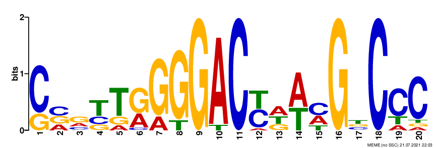
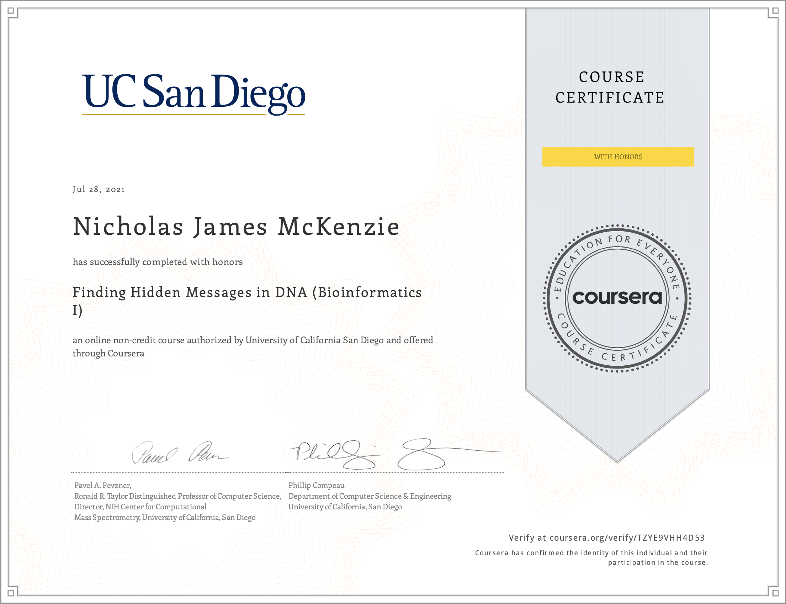

## [Bioinformatics Specialization (University of California San Diego, by Coursera)](https://www.coursera.org/specializations/bioinformatics) 

### <ins><b>Specialization still in progress</b></ins>: 
1 course completed, 6 more to go.

<ins>Description of the Bioinformatics Specialization by the instructors:</ins> 
When you complete this Specialization, you will learn how to answer many questions in modern biology that have
become inseparable from the computational approaches used to solve them.  You will also obtain a toolkit of
existing software resources built on these computational approaches and that are used by thousands of biologists
every day in one of the fastest growing fields in science.
Although this Specialization centers on computational topics, you do not need to know how to program in
order to complete it. If you are interested in programming, we feature an "Honors Track"
(called "hacker track" in previous runs of the course). The Honors Track allows you to implement
the bioinformatics algorithms that you will encounter along the way in dozens of automatically graded
coding challenges. By completing the Honors Track, you will be a bioinformatics software professional!

The Specialization takes roughly 9 months to complete and is composed predominantly of programming
tasks and quizzes. The programming tasks require highly optimized algorithms that solve complex problems
on large (most often genomic) datasets in under 5 minutes per problem. It is not the algorithm that is easiest to write that is the
solution, but rather the algorithm sufficiently fast enough in order to pass.

Below is a summary of the course content and assignments. Code is not shown
to comply with the course guidelines. I may post my detailed course notes in
a future update.

Some acquired skills for this specialization are:
* Whole Genome Sequencing
* Viterbi Algorithm
* Suffix Tree
* Python Programming
* Algorithms
* Unweighted Pair Group Method with Arithmetic Mean (UPGMA)
* Bioinformatics
* Bioinformatics Algorithms
* Dynamic Programming
* Graph Theory

---

### [Course 1: Finding Hidden Messages in DNA (Bioinformatics I)](https://www.coursera.org/learn/dna-analysis?specialization=bioinformatics)

<ins>Acquired skills:</ins> 
* Bioinformatics
* Bioinformatics Algorithms
* Algorithms
* Python Programming

<ins><b>Week 1: Where in the Genome Does Replication Begin? (Part 1/2)</b></ins>

* Write a function called PatternCount which counts the number of times a short DNA pattern occurs
within a larger DNA genome sequence.
* Write a function called BetterFrequentWords which returns the most frequent k-mers within a large
DNA sequence of specified length k.
* Write a function called ReverseComplement which accepts a DNA sequence and returns the reverse complement.
* Write a function called PatternMatch which accepts a short DNA pattern and a large DNA genome string, and
returns the indices at which the pattern appears in the genome.
* Write a function called FindClumps which finds k-mers of length k that appear within shorter sections of
the DNA of length L, and occur in these sections at least t times.
* Pass a graded quiz with questions relating to the biology theory and others that makes use of the above algorithms.

<ins><b>Week 2: Where in the Genome Does Replication Begin? (Part 2/2)</b></ins>

* Write a function called MinimumSkew, which finds the indices of the minimum GC% skew of a large DNA sequence.
* Write a function called HammingDistance, which calculates the Hamming distance between two DNA strings. Put simply,
this is the number of bases when comparing two sequences of equal length.
* Write a function called PatternMatch, which finds the number of matches in a DNA string for a pattern with at
most d number of mismatches.
* Write a function called ApproximatePatternCount, which computes the Hamming distance between a pattern and
every k-mer substring of a large DNA sequence.
* Write a function called Neighbors, which computes all possible "neighbor" sequences of a DNA pattern which share
the same sequence with at most d number of mismatches.
* Write a function called FrequentWordsWithMismatches, which uses a single map that counts the number of times
a given string has an approximate match in a large DNA sequence.
* Write a function called FrequentWordsWithFrequentMismatchesAndReverseComplements, which performs the same task
as FrequentWordsWithMismatches, only it also searches the reverse complement sequence.
* Pass a graded quiz with questions relating to the biology theory and others that makes use of the above algorithms.

<ins><b>Week 3: Which DNA Patterns Play the Role of Molecular Clocks? (Part 1/2)</b></ins>

* Write a function called MotifEnumeration, which accepts a collection of DNA strings and two integers k and d, and then
returns k-mers of length k with at most d mismatches which occur in every DNA string.
* Write a function called MedianString, which accepts a collection of DNA strings and as integer k, and returns
a k-mer pattern containing the minimum number of mismatches (i.e. the median DNA sequence).
* Write a function called ProfileMostProbableKmer, which accepts a string Text, an integer k, and a 4 x k matrix Profile, and returns a Profile-most probable k-mer in Text.
* Write a function called GreedyMotifSearch, which uses many of the above functions in a complex algorithm to find the set of motifs across a number of DNA sequences that match each other most closely.
* Write a function called DistanceBetweenPatternAndStrings, which calculates the sum of distances between a DNA Pattern and each string in a list of DNA sequences.
* Pass a graded quiz with questions relating to the biology theory and others that makes use of the above algorithms.

<ins><b>Week 4: Which DNA Patterns Play the Role of Molecular Clocks? (Part 2/2)</b></ins>

* Write a function called RandomizedMotifSearch, which accepts a collection of DNA strings and two integers k and t, 
and returns a collection BestMotifs resulting from running RandomizedMotifSearch(Dna, k, t) 1,000 times.
* Write a function GibbsSampler which is a more cautious version of RandomizedMotifSearch, and utilises many of the above functions. It takes a parameter N corresponding to the number of iterations that we plan to run the program. The algorithm discards a single k-mer from the current set of motifs at each iteration and decides to either keep it or replace it with a new one.

<ins><b>Week 5: Bioinformatics Application Challenge</b></ins>

* In this assignment task, we are looking for a ~20bp motif within the upstream region of some genes which are
differentially regulated by the same transcription factor.
* Use [Consensus](http://stormo.wustl.edu/consensus/html/Html/main.html) (Hertz and Stormo, 1999),
[WebLogo](http://weblogo.threeplusone.com/) and 
[MEME](http://meme-suite.org/tools/meme)
to generate motif logos from the provided sequences of the upstream regions some genes of interest.
* Short-answer questions related to the analysis and conclusions from the data.

Example figure:

Verify this certificate at: [coursera.org/verify/TZYE9VHH4D53](https://www.coursera.org/verify/TZYE9VHH4D53)

---

### [Course 2: Genome Sequencing (Bioinformatics II)](https://www.coursera.org/learn/genome-sequencing?specialization=bioinformatics)

Acquired skills:
* Algorithms
* Python Programming
* Whole Genome Sequencing
* Dynamic Programming

---

### [Course 3: Comparing Genes, Proteins, and Genomes (Bioinformatics III)](https://www.coursera.org/learn/comparing-genomes?specialization=bioinformatics)

Acquired skills:
* Bioinformatics
* Graph Theory
* Bioinformatics Algorithms
* Python Programming

---

### [Course 4: Molecular Evolution (Bioinformatics IV)](https://www.coursera.org/learn/molecular-evolution?specialization=bioinformatics)

---

### [Course 5: Genomic Data Science and Clustering (Bioinformatics V)](https://www.coursera.org/learn/genomic-data?specialization=bioinformatics)

---

### [Course 6: Finding Mutations in DNA and Proteins (Bioinformatics VI)](https://www.coursera.org/learn/dna-mutations?specialization=bioinformatics)

---

### [Final Course: Bioinformatics Capstone: Big Data in Biology](https://www.coursera.org/learn/bioinformatics-project?specialization=bioinformatics)

